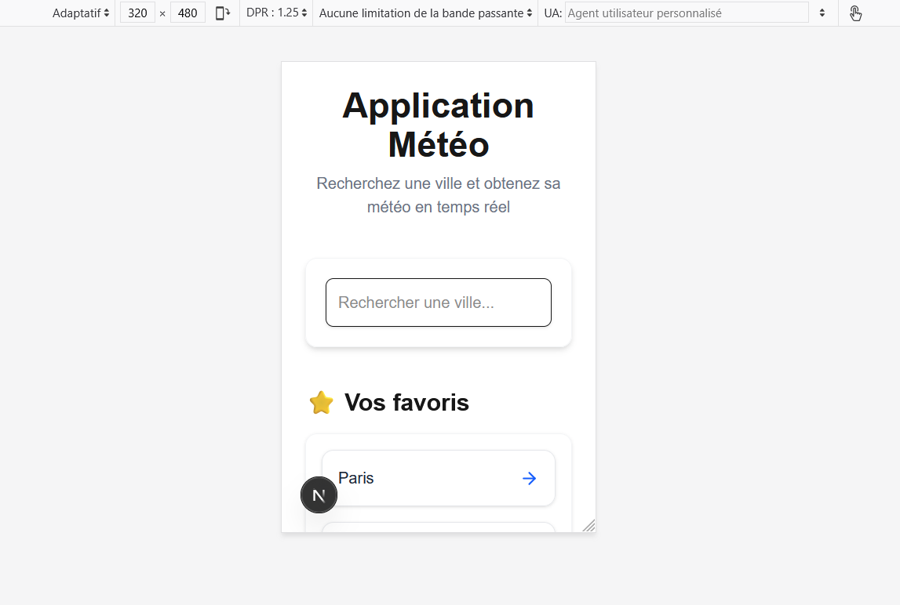
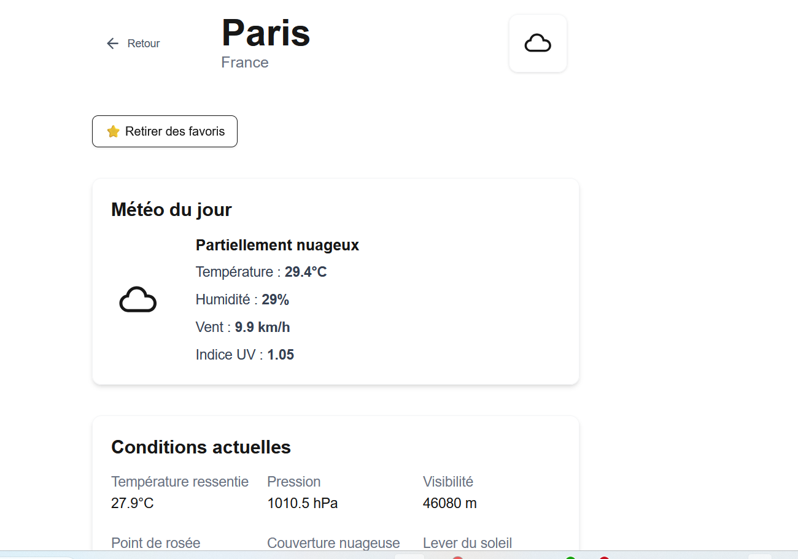
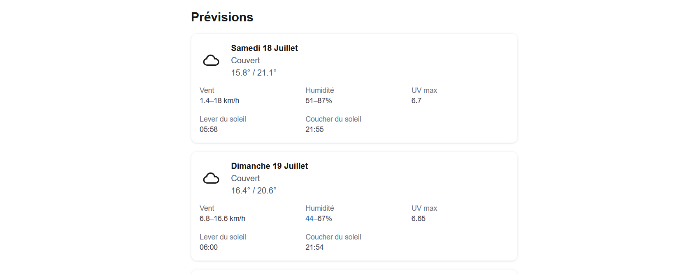

# Weather App — Application Météo

Application météo moderne construite avec Next.js 14, TypeScript, TailwindCSS et les API Open‑Meteo.

## Aperçu du projet

Fonctionnalités principales :

 - Recherche de ville avec suggestions
 - Page météo détaillée
 - Météo du jour
 - Conditions actuelles
 - Prévisions journalières enrichies
 - Icônes météo dynamiques
 - Gestion des favoris (localStorage)
 - Formatage des dates et heures
 - Loader pendant le chargement
 - Gestion des erreurs API
 - Interface responsive mobile → desktop

## Technologies utilisées

 - Next.js 14 (App Router)
 - React
 - TypeScript
 - TailwindCSS
 - Open‑Meteo API
 - Open‑Meteo Geocoding API
 - LocalStorage
 - ESLint / Prettier
 
## API utilisées

- Geocoding API

Convertit un nom de ville en coordonnées GPS.

```bash
https://geocoding-api.open-meteo.com/v1/search
```

- Weather API

Récupère la météo actuelle + prévisions journalières.

```bash
https://api.open-meteo.com/v1/forecast
```


Structure du projet

```bash
app/
 ├── page.tsx                → page d’accueil
 └── ville/[name]/page.tsx   → page météo d’une ville

components/
 ├── BackButton.tsx
 ├── FavoriteButton.tsx
 ├── Loader.tsx
 ├── WeatherIcon.tsx

lib/
 ├── weather.ts              → appels API
 ├── types.ts                → types TypeScript
 ├── formatDate.ts           → formatage des dates
 ├── formatTime.ts           → formatage des heures
 ├── weatherDescription.ts   → description météo FR
```

## Installation

1. Cloner le projet

```bash
git clone <url-du-projet>
cd weather-app
```

2. Installer les dépendances

```bash
npm install
```

3. Lancer le projet

```bash
npm run dev
```

Le projet sera disponible sur :

- http://localhost:3000

## Configuration

Créer un fichier .env.local :

```bash
NEXT_PUBLIC_WEATHER_API=https://api.open-meteo.com/v1/forecast
NEXT_PUBLIC_GEOCODING_API=https://geocoding-api.open-meteo.com/v1/search
```

## Fonctionnalités détaillées

- Météo du jour

    - Icône météo
    - Description
    - Température
    - Humidité
    - Vent
    - UV

- Conditions actuelles 

    - Température ressentie
    - Pression
    - Visibilité
    - Point de rosée
    - Couverture nuageuse
    -Lever du soleil
    - Coucher du soleil

- Prévisions journalières
    - Températures min/max
    - Description météo
    - Vent min/max
    - Humidité min/max
    - UV max
    - Lever/coucher du soleil formatés

- Favoris
    - Ajouter / retirer une ville
    - Stockage dans localStorage
    - Affichage sur la page d’accueil

- Gestion des erreurs

    - Ville introuvable
    - API indisponible
    - Loader pendant le chargement

## Responsive design

Mobile : interface compacte

Desktop : interface large

Grands écrans : mise en page premium

## Qualité du code

- Types stricts
- Composants réutilisables
- API centralisée
- Formatage automatique (Prettier)
- Pas de warnings Next.js


## 📸 Aperçu de l’application

Voici un aperçu de l’interface :





